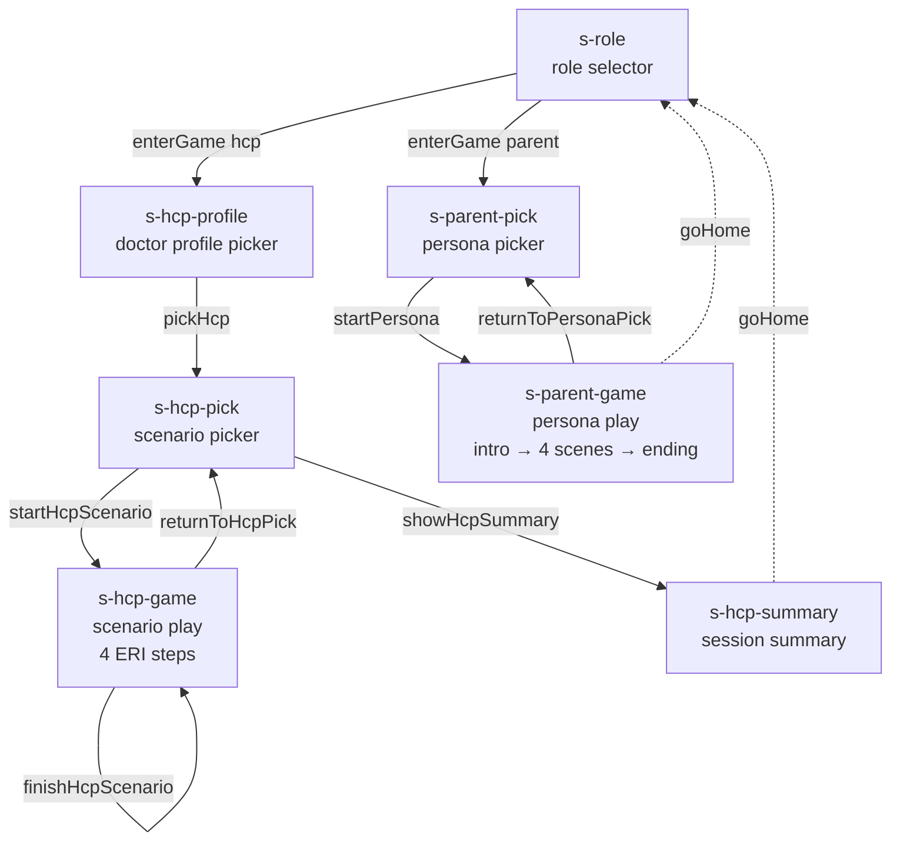

# 04 — Architecture

This chapter describes the technical structure of the game: how the files relate, what state is held where, how the language pack works, how URL parameters reshape behaviour, and how the project is hosted.

The aim is to make the codebase easy to navigate for two readers: a developer who wants to extend it, and a researcher who wants to verify how a published construct (chapter [03](03-science.md)) is realised in software.

## 1. File layout

Everything ships as static files. There is no build step, no bundler, no transpiler. A browser opens `index.html`, executes five `<script>` tags in order, and runs.

```
hpvGame/
├── index.html                # game shell — screens as <section>s, no logic
├── styles.css                # one stylesheet, no preprocessor
├── ui.js                     # i18n: UI = { sr: {…}, en: {…} } + t() lookup
├── analytics.js              # anonymous Supabase logging (fire-and-forget)
├── scenarios.js              # Game 01 content: HCP_PROFILES, HCP_SCENARIOS
├── personas.js               # Game 02 content: PERSONAS (4 active + 4 stubs)
├── engine.js                 # all game logic, state, render functions
│
├── admin.html                # facilitator hub (Supabase Auth)
├── stats.html                # facilitator dashboard (filters + CSV export)
├── qr.html                   # workshop QR-code generator
├── validate.html             # drag-drop personas.js → static validator (planned)
│
├── _TEMPLATE_persona.js      # copy-paste template with field comments
├── scripts/
│   └── translate.js          # Node 18+ Gemini API translator (see chapter 09)
├── notes/
│   ├── queries.sql           # Supabase SQL cheatsheet for analysis
│   └── README.md
└── docs/                     # this documentation
```

Approximate sizes (lines of code, May 2026):

| File | Lines | Edit frequency |
|---|---:|---|
| `engine.js` | 740 | Rarely (logic) |
| `personas.js` | 271 (large objects) | Often (content) |
| `scenarios.js` | 214 (large objects) | Often (content) |
| `ui.js` | 262 | Sometimes (UI strings) |
| `styles.css` | 327 | Rarely (visual changes) |
| `analytics.js` | 169 | Almost never |
| `index.html` | 172 | Almost never |

The intentional split is: **content** (`scenarios.js`, `personas.js`, `ui.js`) is edited regularly; **engine and chrome** (`engine.js`, `styles.css`, `index.html`) are touched only when behaviour or layout changes. The constraint is enforced socially, not technically — a content editor *can* edit `engine.js`, but they shouldn't need to.

## 2. Script load order

`index.html` ends with this block:

```html
<script src="ui.js"></script>
<script src="analytics.js"></script>
<script src="scenarios.js"></script>
<script src="personas.js"></script>
<script src="engine.js"></script>
```

The order matters and is deliberately fragile:

1. **`ui.js` first.** It defines `UI`, `t()`, and `applyI18n()`. Every subsequent script may need to look up translated strings.
2. **`analytics.js` next.** It is fire-and-forget — its `track()` function must exist before any game event fires. It is defensive about the global `S` not yet existing (e.g. in `_lastScreen()` it does `typeof S !== "undefined"`).
3. **`scenarios.js` and `personas.js`** declare the content constants `HCP_PROFILES`, `HCP_SCENARIOS`, `PERSONAS`. They are inert data.
4. **`engine.js` last.** It defines `S`, the dispatcher functions (`getScenarios`, `getProfiles`, `getPersonas`), all render functions, and the `DOMContentLoaded` bootstrap. It assumes everything above has loaded.

There is no module system. Everything attaches to the global scope. This is intentional: it is the simplest possible setup for a static site and removes the need for a build step.

## 3. Screen flow

The game is built from seven `<section>` elements, all rendered into the same page; `showScreen(id)` hides them all and reveals one. There is no URL routing — navigation lives entirely in the script.



The complete list of section IDs is fixed and hard-coded in `showScreen()` (`engine.js:67`):

```
s-role, s-hcp-profile, s-hcp-pick, s-hcp-game,
s-hcp-summary, s-parent-pick, s-parent-game
```

Within `s-hcp-game` and `s-parent-game`, the *steps* of a scenario / *scenes* of a persona advance by re-rendering the inner card, not by switching sections.

## 4. State (the `S` object)

A single global object holds everything the player has done, including both games. It is declared at the top of `engine.js` and persisted to `localStorage` under the key `ondk_v2`.

```js
const STORAGE_KEY = "ondk_v2";
let S = {
  // ── Routing ──
  screen: "role",        // which section is visible
  game: null,            // 'hcp' | 'parent'
  mode: "retry",         // 'retry' | 'sim' (locks choices, no retry)
  lang: "sr",            // 'sr' | 'en'

  // ── Game 01 (HCP) ──
  hcpProfile: null,                 // selected doctor profile id
  hcpScenarioIdx: null,             // current scenario index
  hcpCompletedScenarios: [],        // indices already finished
  hcpStepIdx: 0,                    // 0…3 within current scenario
  trust: 50, will: 30,              // meters, 0–100
  hcpResults: [],                   // final scores per scenario in session
  hcpScenarioLog: [],               // every attempt in current scenario
  totalRoots: 0, totalGood: 0,      // session counters

  // ── Game 02 (Parent) ──
  personaIdx: null,
  pSceneIdx: 0,                     // -1 = intro, 0…3 = scenes, 4 = ending
  pPath: [],                        // unlock tags accumulated
  pChoices: [],                     // every choice made
  anks: 50, sas: 0, otv: 15, odluka: 20,  // 4 meters, 0–100
  pEnding: null                     // 'best'|'rushed'|'delayed'|'mid'|'pending'|'closed'
};
```

`saveState()` is called after every meaningful event (a click, a screen change). `loadState()` runs once at `DOMContentLoaded` and merges any persisted state into `S`. This gives the game a "resume where you left off" feel without any backend.

The flat structure — `trust`/`will` and `anks`/`sas`/`otv`/`odluka` share the same `S` — is intentional: the two games never run simultaneously, and a flat namespace is easier to inspect in DevTools than nested objects.

## 5. Language pack pattern

The game ships in Serbian (Latin script) and English. Translation works at two levels:

**UI strings** live in `ui.js`:

```js
const UI = {
  sr: { "step.eri.0": "Eliciraj", "btn.home": "Početak", … },
  en: { "step.eri.0": "Elicit",   "btn.home": "Home",     … }
};
function t(key, params) {
  const dict = UI[S?.lang] || UI.sr;
  let s = dict[key] ?? UI.sr[key] ?? key;
  // {placeholder} substitution
  if (params) for (const k in params) s = s.replace(`{${k}}`, params[k]);
  return s;
}
```

Static HTML text uses `data-i18n="key"` attributes; `applyI18n()` walks them and rewrites `innerHTML` on language change.

**Content** (scenarios, personas, profiles) lives in the data files with a `{ sr: […], en: […] }` shape:

```js
const HCP_SCENARIOS = {
  sr: [ {title: "Aluminijum…", steps: [...], … }, … ],
  en: [ {title: "Aluminium…",  steps: [...], … }, … ]
};
```

The engine never reads `HCP_SCENARIOS` directly. It goes through dispatcher helpers that fall back to Serbian if English is missing:

```js
function getScenarios() {
  const en = HCP_SCENARIOS?.en, sr = HCP_SCENARIOS?.sr;
  if (S.lang === "en" && en && en.length) return en;
  return sr || [];
}
// Same shape for getProfiles() and getPersonas().
```

This pattern matters in two situations: while a translation is still in progress (some personas translated, others not), and when a content editor adds new Serbian material before the translation pipeline catches up. In both cases the game continues to work in Serbian; the language toggle simply has nothing better to show.

Language is fixed by, in priority order:

1. `?lang=en` URL parameter (set by `qr.html` for international workshops),
2. `S.lang` from `localStorage`,
3. Default: `"sr"`.

Switching language at runtime is handled by `setLang()`, which calls `applyI18n()` for static text and then `rerenderCurrentScreen()` for dynamic content. The current screen ID is inferred from which `<section>` is not `.hidden`.

See [09 — i18n](09-i18n.md) for the translation pipeline (`scripts/translate.js`).

## 6. URL parameters

Three URL parameters reshape the game without code changes:

| Param | Values | Effect | Set by |
|---|---|---|---|
| `?w=` | any slug (e.g. `novi-sad-2026-05`) | Groups all sessions opened from this URL under one *workshop ID* in analytics. | `qr.html`, `admin.html` |
| `?mode=` | `retry` (default), `sim` | In *sim* mode, the player cannot re-try a step; the first choice is locked in and the conversation continues with consequences. | `qr.html`, `admin.html` |
| `?lang=` | `sr` (default), `en` | Forces the game language for this session, overriding any saved preference. | `qr.html`, `admin.html` |

All three are read once on `DOMContentLoaded`. They are *not* re-evaluated on language toggle or screen change — the URL state is interpreted at load time and then committed to `S`.

A typical workshop URL looks like:

```
https://hpvgame.pages.dev/?w=novi-sad-2026-05&mode=sim&lang=en
```

## 7. Persisted vs. ephemeral

| Storage | Key | Lifetime | Purpose |
|---|---|---|---|
| `localStorage` | `ondk_v2` | Until cleared | Full `S` object — resume in progress |
| `localStorage` | `ondk_sid_v1` | Until cleared | Anonymous UUID session id for analytics |
| `localStorage` | `ondk_analytics_consent_v1` | Until cleared | `"declined"` if user opted out |
| In-memory | `S` | Tab lifetime | Live game state |
| Server | Supabase `events` table | Indefinite | Anonymous analytics payloads |

There is no cookie. There is no user account in the game itself (only in `admin.html` / `stats.html`, which require Supabase Auth to read events).

## 8. Analytics in one paragraph

Every meaningful click in the game calls `track(eventType, payload)` (`analytics.js:112`). `track()` POSTs to Supabase's PostgREST endpoint with the anonymous session id, the workshop id, the event type, and a JSON payload. The payload is automatically enriched with `t_ms` (ms since page load), `ver` (game version from a `<meta>` tag), `mode` (`retry`/`sim`), and `lang` (`sr`/`en`). Network failures are swallowed silently so the game cannot be blocked by a flaky network. See [07 — Analytics](07-analytics.md) for the full event vocabulary and the `events` table schema.

## 9. Facilitator tools

Three separate HTML pages serve facilitator workflows. They share styling with the game but have no game logic.

| Page | Role | Auth |
|---|---|---|
| `qr.html` | Generate workshop URL + QR code + printable PDF. Pre-set workshop ID, mode, language. | None (public) |
| `admin.html` | Hub linking to stats, QR generator, direct game link. Built-in URL builder. | Supabase Auth |
| `stats.html` | Live dashboard: session counts, ERI step quality, choice distribution, funnel, CSV export. | Supabase Auth |
| `validate.html` | Drag-drop `personas.js`, report structural errors (missing scenes, broken `req`/`unlock` pairs). | None (planned) |

## 10. Hosting

The site is hosted on **Cloudflare Pages** at `hpvgame.pages.dev`, deployed by pushing to `main` on GitHub. The project is purely static — there is no server runtime to provision.

There is no server runtime. The only external service is Supabase, accessed directly from the browser using the *publishable* (anon) key. Row-Level Security on the Supabase side restricts anonymous clients to `INSERT` on the `events` table; reading requires authenticated access through `stats.html`.

## 11. What deliberately *is not* in the architecture

A few absences are worth naming because they would be the first things a senior reader looks for:

- **No build step, no bundler.** Files are served as-authored. The trade-off is no minification and no module system; the win is zero infrastructure and instant edit-reload.
- **No framework.** No React, no Vue, no Svelte. The render functions construct HTML strings and call `innerHTML`. The trade-off is no component model; the win is that anyone who can read HTML and JavaScript can read the codebase.
- **No URL routing.** `showScreen()` does not change the URL. The trade-off is non-shareable deep links; the win is that the back button never breaks game state.
- **No backend.** Game logic runs entirely in the browser. The trade-off is that we cannot validate analytics submissions server-side; the win is that the game is operable offline and never costs more than a static-hosting bill.
- **No tests.** Behaviour is verified by walking the game in a browser before each release. `validate.html` is the closest thing to a test for content. The trade-off is risk during refactors; the win is that the content authors (who are not engineers) can edit `scenarios.js` and `personas.js` without breaking CI.

These choices are deliberate and have served the project well at the current scale. They would need to be revisited if the codebase grew past a few thousand lines or if multiple developers needed to work on the engine concurrently.

---

*Related chapters:* [03 — Science](03-science.md) explains *why* the data has the shape it does. [05](05-game-01-hcp.md) and [06](06-game-02-parent.md) walk through the two games' specific mechanics. [09 — i18n](09-i18n.md) details the Gemini-based translation pipeline.
