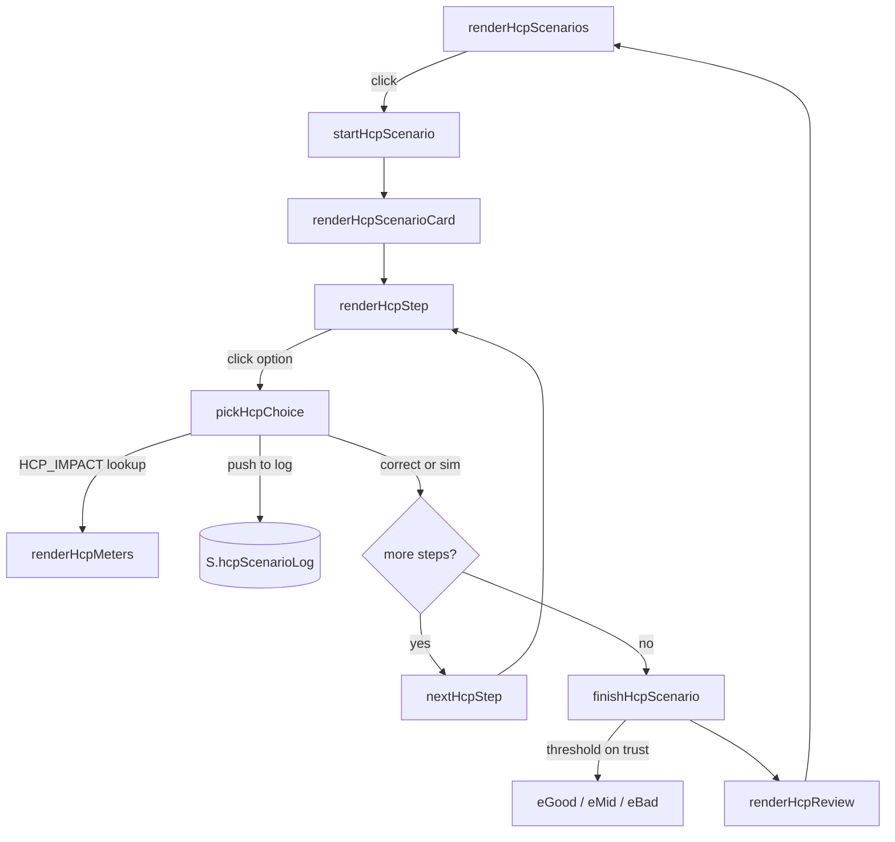

# 05 — Game 01: Conversation with a parent (HCP)

Game 01 puts the player in the role of a healthcare worker (HCW) talking with a vaccine-hesitant parent. It is the analytic half of the project: the four-step ERI rhythm is named on screen, the attitude root is labelled in feedback, and the player gets explicit "better answer" guidance at the end of each scenario.

This chapter walks through the game mechanically — the picker screens, the four-step scenario, the scoring, the endings, and the two play modes — and points at the exact data fields and engine functions involved. The theoretical justification is in chapter [03](03-science.md); this chapter is about *how* it runs.

## 1. The two pickers

A scenario session begins with two choices, in order.

### 1.1 Doctor profile

The player picks one of four cosmetic-only profiles (`HCP_PROFILES`):

| `id` | Label (SR) | Label (EN) | Framing |
|---|---|---|---|
| `pedijatar` | Pedijatar | Pediatrician | Known the family for years. |
| `opsta` | Lekar opšte medicine | General Practitioner | Family doctor, knows family history. |
| `ginekolog` | Ginekolog | Gynecologist | HPV specialist, authority context. |
| `specijalista` | Drugi lekar — specijalista | Other specialist | Second-opinion context. |

**Crucially, profile choice does not change scenario mechanics.** Every scenario plays identically regardless of profile. The choice exists to give the player a frame of mind — "I am the pediatrician this parent has known for years" lands differently from "I am the infectious-disease specialist they were referred to" — without forcing the content to multiply by four.

### 1.2 Scenario

The player then picks one of eight scenarios. Each scenario card shows the title and a one-line label of the parent (e.g. *"Majka · ćerka 13 god."* / *"Mother · 13-year-old daughter"*). Scenarios already completed in this session are marked `· završen` / `· completed`; the player can replay any of them.

A `Završi sesiju` / `Finish session` button appears once any scenario is complete; it routes to the summary screen (see §6).

## 2. Anatomy of a scenario

Each entry in `HCP_SCENARIOS[lang]` looks like this (Scenario 01 abridged):

```js
{
  title: "Aluminium and fetal cells",
  root: "Fear and phobias — toxicity (HPV)",
  startTrust: 45, startWill: 25,
  startWhy: "The mother has been reading the internet for weeks ...",
  maxWhy:   "Marija has been sinking into doubts; one conversation can move a mountain, but not topple it.",
  parent: { i: "M", l: "Mother · 13-year-old daughter" },
  open:   "Doctor, I read on the internet that the HPV vaccine contains aluminium ...",
  steps:  [ {t:"root",  …}, {t:"affirm", …}, {t:"refute", …}, {t:"facts", …} ],
  eGood:  "Thank you for explaining it that way. ... I'll think about it.",
  eMid:   "I'll think about it more.",
  eBad:   "Thank you, doctor. I'll talk with others.",
  take:   "Fear of toxicity is neutralised with **concrete comparative measures** ..."
}
```

Five things are worth naming explicitly:

1. **`root`** is the Fasce attitude-root label. It is **not** shown to the player before they choose — it is the answer to Step 1.
2. **`startTrust` / `startWill` / `startWhy`** put the player into a *specific* opening state. Different parents arrive in different shapes; the game tells the player *why* before the first choice, so the rest of the conversation is interpreted in that light. See chapter [03 §5](03-science.md#5-mapping-scientific-construct--code-location) for the full role of these fields.
3. **`maxWhy`** is the honesty clause. The game's ceiling calculation (`computeHcpMax()`, see §5.2) makes clear that even a perfect conversation often cannot reach 100; `maxWhy` explains in one sentence *why this particular parent* has a lower realistic ceiling.
4. **`parent.i` / `parent.l`** are the avatar initials and the small label under it. Purely cosmetic.
5. **`take`** is the pedagogical lesson shown to the player at the end of the conversation, regardless of outcome — the one sentence the scenario was designed to teach.

The conversation always opens with the parent's `open:` line in a speech bubble, then the four ERI steps run sequentially.

## 3. The four steps (ERI)

Each `steps[i]` has the shape:

```js
{ t: "root" | "affirm" | "refute" | "facts",
  p: "prompt shown to the player",
  o: [ { x: "option text", q?: "good"|"neutral"|"bad", ok?: 0|1, fb: "feedback" }, … ] }
```

`o` is the array of options (typically 3–4). Options are **shuffled on every render** (`shuffle()` in `engine.js`) so the correct answer is not positionally cued. The `_i` original index is tracked through the shuffle so the engine can still look up the impact for the right option.

### 3.1 Step 1 — `t:"root"` (Elicit)

The player picks which of the candidate attitude roots is the load-bearing one for *this* parent. Each option has `ok: 0` or `ok: 1`. There is exactly one `ok:1` option per step.

Feedback (`fb:`) is shown immediately after the click. For the correct option, the feedback names the Fasce category in plain language and reinforces *why* the option fits. For wrong options, the feedback explains the *distinction* — why the candidate root looked plausible but is not the operative one.

### 3.2 Step 2 — `t:"affirm"` (Affirm)

The player picks an empathic affirmation. Each option has `q: "good" | "neutral" | "bad"`. There is no `ok` here — quality is graded on three levels because affirmation is a continuous rather than a binary skill.

### 3.3 Step 3 — `t:"refute"` (Rebut)

Targeted refutation of the specific false claim. Same `q:` grading. This is the step where the *targeting* matters most — a `"good"` refutation addresses the same root identified in Step 1; a `"neutral"` refutation is technically correct but generic; a `"bad"` refutation typically appeals to authority or dismisses.

### 3.4 Step 4 — `t:"facts"` (Inform)

Closing factual information, calibrated to the parent. `"good"` is quantified, comparable, and emotionally proportionate; `"neutral"` is correct but vague. Facts steps never have a `"bad"` option in the current content — the worst-case in this slot is generic-and-forgettable, not actively harmful.

## 4. The visual rhythm — ERI colours

Each ERI step has a dedicated colour to give the player a perceptual sense of the four-beat structure:

| Step | i18n key | SR label | EN label | Colour token |
|---|---|---|---|---|
| 0 | `step.eri.0` | Eliciraj | Elicit | `coral` |
| 1 | `step.eri.1` | Afirmišite | Affirm | `teal` |
| 2 | `step.eri.2` | Opovrgnite | Refute | `gold` |
| 3 | `step.eri.3` | Činjenice | Facts | `plum` |

The colours appear on the step badge (`.step-tag.phase-eli` etc.), the side-panel breadcrumb (`.bar-step-phase.phase-eli`), and the end-of-scenario review (`.review-step.phase-eli`). This is configured in `styles.css`; the engine sets the class name from `ERI_PHASE_KEYS` (`engine.js`).

## 5. Scoring — meters, deltas, ceilings

Two meters drive the scenario outcome:

- **`trust`** (Poverenje / Trust) — the working alliance between HCW and parent.
- **`will`** (Spremnost / Acceptance) — the parent's willingness to accept the vaccine.

Both are clamped to `[0, 100]` by `clamp()` on every change.

### 5.1 The `HCP_IMPACT` lookup

Every quality flag maps deterministically to a `{trust, will}` delta, defined in one constant at the top of the HCP section of `engine.js`:

```js
const HCP_IMPACT = {
  root:   { correct:   {trust: +5},
            incorrect: {trust: -3} },
  affirm: { good:    {trust: +15},
            neutral: {trust:   0},
            bad:     {trust: -15} },
  refute: { good:    {trust: +10, will: +20},
            neutral: {will:   +5},
            bad:     {trust: -10, will: -10} },
  facts:  { good:    {trust:  +5, will: +20},
            neutral: {will:   +5} }
};
```

Three things are worth noting about this table:

1. **Step 1 (root) has the smallest range** (±5 / ±3). Misidentifying the root is not catastrophic — the conversation continues — but a correctly-identified root sets the rest of the conversation up well.
2. **Step 2 (affirm) is the largest single trust swing** (±15). A good affirmation buys you the rest of the conversation; a bad one is hard to recover from.
3. **Steps 3 and 4 are the only sources of `will`** (vaccine acceptance). Trust without acceptance is a familiar pattern in real conversations — the parent likes you but is not yet ready to vaccinate. The mechanic reflects that.

The lookup is the single source of truth. Changing scoring balance means changing exactly this table; the content files do not need to be touched.

### 5.2 The maximum achievable score

`computeHcpMax()` calculates the best-case ceiling for a scenario:

```js
function computeHcpMax(sc){
  const startT = sc.startTrust ?? 50;
  const startW = sc.startWill  ?? 30;
  return {
    maxTrust: Math.min(100, startT + 35),   // +5 root + +15 affirm + +10 refute + +5 facts
    maxWill:  Math.min(100, startW + 40)    // +20 refute + +20 facts
  };
}
```

A scenario that starts at `trust: 35` is *theoretically* capped at `trust: 70` — exactly the threshold for a good ending. This is by design: scenarios with low start values are harder, and the player needs to play perfectly to clear them. The "Krajnji rezultat X / Y" / "Final result X / Y" display at the end shows both the achieved and the ceiling so the player can see how close they got to the perfect run.

### 5.3 Feedback pills (the `+X` chips)

After each choice the engine shows the deltas as small coloured pills next to the feedback text:

> `+15 Poverenje` (green) · `+20 Spremnost` (green)

The pill rendering is `impactPills()` (`engine.js`); it filters out zero-deltas so the player only sees what actually moved. Pills also appear in the end-of-scenario review so the player can audit which choices made the difference.

## 6. Endings — three branches

When the four steps are complete, `finishHcpScenario()` selects one of three ending branches based on final `trust`:

| Final `trust` | Branch | Field |
|---|---|---|
| ≥ 70 | Good — parent leaves open-minded | `eGood` |
| 40 – 69 | Middle — parent will think about it | `eMid` |
| < 40 | Bad — parent disengages | `eBad` |

`will` is *not* part of the branch selection — it is shown as an outcome metric but does not change the wording of the ending. This is deliberate: in the literature, the immediate post-conversation behaviour (a parent saying "I'll think about it" vs. "I'm done") is driven primarily by *how heard they felt*, not by their final acceptance level.

The ending screen shows, in this order:

1. A short "tone" line (`outcome.good` / `outcome.mid` / `outcome.bad` from `ui.js`).
2. The parent's closing speech bubble (`eGood` / `eMid` / `eBad`).
3. The take-away lesson (`take:` field from the scenario).
4. The end-of-scenario review (see §7).
5. A button back to the scenario picker.

## 7. End-of-scenario review

`renderHcpReview()` produces the retrospective. For every step, it lists every attempt the player made (in retry mode they may have several), with:

- the option text in quotes,
- the quality icon (`✓` for `good`, `✗` for any non-good final choice),
- the meter deltas as pills,
- the feedback that was originally shown.

If the player's *last* choice in a step was not `good`, the review additionally shows:

- For Step 1: `"Correct root was: «{option}»"`.
- For Steps 2–4: `"Better answer would be: «{option}»"` plus that option's feedback text.

This is the single most pedagogically explicit moment in the game. In simulation mode (§8) it's the only chance the player has to see the "right" answer for a step they got wrong.

The review is generated from `S.hcpScenarioLog`, which is populated by every `pickHcpChoice()` call:

```js
S.hcpScenarioLog.push({
  stepIdx, stepType, choiceIdx, quality,
  dt, dw,            // trust / will deltas this attempt
  attemptIdx         // 1, 2, 3 ... within this step
});
```

So the review is data, not magic — it reflects exactly what happened.

## 8. Two play modes — retry vs. sim

The game has two modes, fixed at page load by `?mode=` (see chapter [04 §6](04-architecture.md#6-url-parameters)).

### Retry mode (default)

The player can re-pick any wrong step option until they get a `good` (or `ok:1`) choice. Wrong choices are disabled visually but the others remain clickable. Meter deltas accumulate from every attempt — a player who clicks "bad" then "good" will end the step with the *net* of both. Once the correct option is chosen, the "Next step" button appears.

**When to use:** initial training, individual self-practice, low-pressure workshops.

### Simulation mode (`?mode=sim`)

The first choice is locked in. All options disable immediately after the first click. Meter deltas reflect only that one attempt. The "Next step" button always appears, regardless of whether the choice was good. Feedback labels swap (`fb.sim.bad` reads *"Risky — the conversation continues with consequences"* rather than *"Risky — try a different answer"*).

**When to use:** advanced workshops, debrief practice, when you want the player to *feel* the cost of a single rushed choice. The end-of-scenario review's "Better answer would be" hint is the safety net that ensures the player still learns from the wrong choice.

Mode is fixed at page load and cannot be changed mid-session. A workshop facilitator chooses mode when generating the QR code (`qr.html`); within the game itself there is no toggle, intentionally — the choice is a workshop-design decision, not a per-player one.

## 9. Session summary

After completing any number of scenarios in a session, the player can click *"Završi sesiju"* / *"Finish session"* to see a summary (`s-hcp-summary`). The summary shows:

- Average final `trust` and `will` across completed scenarios.
- Number of attitude roots correctly identified (out of total scenarios played).
- Number of `good` choices in steps 2–4 (out of `3 × n` possible).
- A list of five generalised take-aways drawn from the literature (`summary.takes.1` … `summary.takes.5` in `ui.js`).
- A citation line acknowledging Fasce 2023 and Holford 2024.

The summary is generated from `S.hcpResults` (one entry per completed scenario) and the running counters `S.totalRoots` / `S.totalGood`.

## 10. Engine functions in one diagram

For an at-a-glance map of the call flow during one scenario:



## 11. What this game does *not* do (yet)

Three deliberate omissions:

- **No carry-over between scenarios.** Each scenario resets to its own `startTrust` / `startWill`. A session is a series of independent conversations. Carrying trust across scenarios is on the roadmap (chapter [10](10-roadmap.md)) but raises pedagogical questions: a single bad scenario early would discourage rather than teach.
- **No branching within a scenario.** All eight scenarios are linear four-step sequences. Mid-scenario branching based on `unlock` tags (the mechanic used in Game 02) is on the roadmap for HCW scenarios but not implemented.
- **No adaptive scenario selection.** The scenario picker is a flat grid in scenario order. A future version could surface scenarios that target the attitude roots the player has been weakest on.

These limits are not accidents — they are the floor that lets a content editor add a new scenario without thinking about graph topology or carry-over interactions.

---

*Related:* [03 — Science](03-science.md) explains the academic basis for the four-step structure. [06 — Game 02 (Parent)](06-game-02-parent.md) is the experiential counterpart. [08 — Extending](08-extending.md) walks through adding a new scenario step by step.
