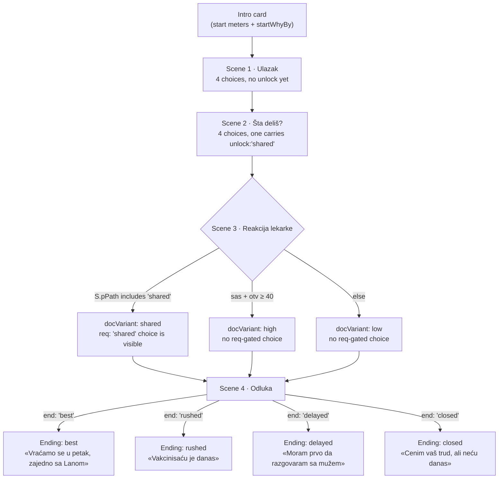
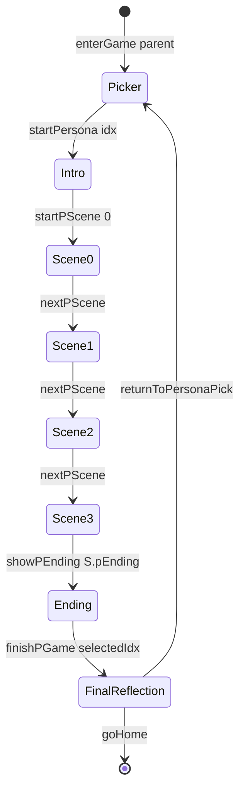
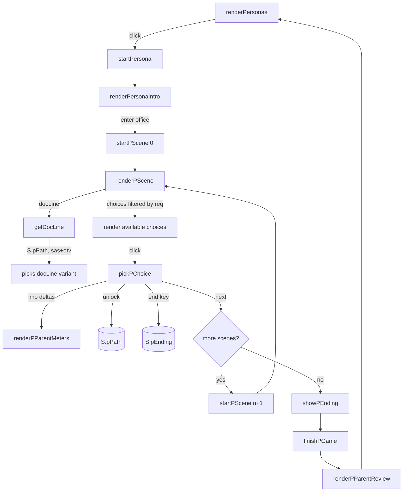

# 06 — Game 02: In the parent's shoes

Game 02 inverts the perspective of Game 01. The player becomes a hesitant parent and plays through a short, experiential conversation with a doctor. There is no "right answer". The game does not name the attitude root, does not show a quality flag, does not announce a winner.

What it does is let the player *feel* — through inner monologue, meter swings, and adaptive doctor dialogue — why a reasonable person can hesitate. The pedagogical theory is in chapter [03 §6](03-science.md#6-a-note-on-game-02-and-the-experiential-design-choice). This chapter is the mechanical walkthrough.

## 1. The persona roster

There are eight personas in `PERSONAS[lang]`. Four are fully written; four are stubs that show a *"Coming soon"* badge and trigger an alert if clicked.

| # | `id` | Name | Tag (player-facing) | Status | Underlying attitude root |
|---|---|---|---|---|---|
| 1 | `marija` | Marija | *"After COVID I no longer trust the system"* | Active | Distrust — institutional, post-COVID |
| 2 | `jelena` | Jelena | *"I've been reading labels for seven years"* | Active | Fear / phobias — toxicity (informed lay-expert variant) |
| 3 | `sanja` | Sanja | *"Iva is still a child — this isn't the topic for her age"* | Active | Moral concerns — promiscuity / family values |
| 4 | `petar` | Petar | *"I want a reasoned debate, not blind acceptance of authority"* | Active | Distrust — *do your own research* (philosophy-of-science variant) |
| 5 | `goran` | Goran | *"I'm suspicious of multinationals"* | Stub | Conspiracy / Big Pharma |
| 6 | `dragan` | Dragan | *"If it ain't broken, don't fix it"* | Stub | Unfounded beliefs — generational fatalism |
| 7 | `tijana` | Tijana | *"The body knows itself"* | Stub | Unfounded beliefs — natural is better |
| 8 | `maja` | Maja | *"The neighbour's daughter had a severe reaction"* | Stub | Fear / dreadful injuries (anecdote-driven) |

The active four are the ones a workshop facilitator can actually rely on; the stubs are scaffolding for future content (see chapter [10](10-roadmap.md)). Stub click is handled by `stubClick()` which simply shows an alert.

Character names stay in Serbian across both language packs — they are not localised. This is a deliberate choice: a Serbian name keeps the lived-in feel of the scenario even when the rest of the text is in English.

## 2. Anatomy of a persona

Every active persona has the same six-block shape:

```js
{
  id: "marija", active: 1, name: "Marija",
  tag:  "After COVID I no longer trust the system",
  hook: "Her aunt died two years ago. The pediatrician recommends ...",

  // 1. Introduction — what the player reads before the conversation
  intro: [ "You are 38. Lana is 14.", "Two years ago your aunt …", … ],

  // 2. Starting meter values
  start: { anks: 75, sas: 5, otv: 15, dec: 20 },
  startWhy:    "After her aunt's loss …",         // optional flat sentence
  startWhyBy: { anks: "…", sas: "…", otv: "…", dec: "…" },  // optional per-meter

  // 3. The doctor across the desk
  doc: { i: "MJ", l: "Dr Marija Janković, pedijatrica" },

  // 4. Four scenes
  scenes: [ { title: "Ulazak", … }, … ],

  // 5. Endings keyed by the value emitted in scenes[3].choices[*].end
  endings: { best: {…}, rushed: {…}, delayed: {…}, closed: {…} },

  // 6. Closing line shown after the chosen ending narrative
  finalLine: "Thank you for living Marija's story for ten minutes."
}
```

A few non-obvious details:

- **`hook`** is *not* shown to the player. It is a one-line note for facilitators — context that helps them frame the persona before a workshop.
- **`startWhy` vs. `startWhyBy`**. The flat `startWhy` is a single sentence shown beneath the four starting values. The richer `startWhyBy` is a per-meter explanation (anks, sas, otv, dec). When present, the engine renders a four-row table; otherwise it falls back to the flat sentence. The four active personas all use `startWhyBy`.
- **`doc`** is per-persona, not per-scene. The same doctor runs through all four scenes for any one persona.
- **`finalLine`** is the gentle bow at the end — it acknowledges that the player has been "inhabiting" this person for the duration.

## 3. The four meters

Game 02 has four meters, all in `[0, 100]`, all clamped by the same `clamp()` used in Game 01.

| Field | UI label (SR) | UI label (EN) | What it represents |
|---|---|---|---|
| `S.anks` | Anksioznost | Anxiety | The parent's level of fear / threat-vigilance. *Higher = more closed*. |
| `S.sas` | Saslušanost | Feeling heard | How seen the parent feels by the doctor. *Higher = more open to dialogue*. |
| `S.otv` | Otvorenost | Openness | The parent's willingness to consider changing position. |
| `S.odluka` | Prihvatanje vakcinacije | Vaccination acceptance | The headline meter: 0 = firmly against, 100 = firmly for. |

The state variable name (`S.odluka`) does not match the data field (`dec`) — historical artefact. The mapping is fixed in `startPersona()`:

```js
S.odluka = p.start.dec != null ? p.start.dec : 20;
```

Choices specify their impact under the field `dec`, but the engine reads/writes `S.odluka`. Anyone editing personas works only with `dec`.

The decision meter has a special UI treatment in the side panel — it carries an annotation row ("against vaccination" ↔ "for vaccination") to make the centre-zero polarity readable at a glance.

## 4. A scene

Each scene is a single screen of conversation:

```js
{
  title: "Ulazak",                           // shown in the bar at top
  docLine: "Marija, good day. Thank you ...", // OR docHigh+docLow OR docVariants

  prompt: "What do you feel as you listen?",

  choices: [
    {
      em: "Relief",
      in: "She's asking me, not commanding. This is different.",
      imp: { anks: -10, sas: 15, dec: 5 },
      re:  "Your shoulders drop a millimetre. ...",
      unlock: "shared"   // optional
    },
    { em: "Caution",    in: "…", imp: { … }, re: "…" },
    { em: "Suspicion",  in: "…", imp: { … }, re: "…" },
    {
      em: "Surprise",   in: "…", imp: { … }, re: "…",
      req: "shared"     // optional — only visible if "shared" is in S.pPath
    }
  ]
}
```

Two things distinguish a Game 02 choice from a Game 01 option:

1. **A choice has three text fields, not one.** `em` is the emotion label (bold); `in` is the inner monologue (italic, in first person); `re` is the reaction narration shown *after* the click. Together they create the experiential layering: choose an emotion → see your inner thought → live the reaction.
2. **A choice has no quality flag.** There is no `q:"good"`, no `ok:1`. The framing is felt, not graded. The mechanical consequence is captured entirely by the `imp` block.

The doctor's line is rendered by `getDocLine(scene)` which handles three fallback patterns — see §6 below.

## 5. The unlock / req mechanic

This is the branching device that makes Game 02 feel personal even though the scenes themselves run linearly.

- A choice with `unlock: "tag"` pushes the tag onto `S.pPath` (an array of strings, persisted in state).
- A later choice with `req: "tag"` is **only shown** if `tag` is already in `S.pPath`.

The filtering happens in `renderPScene()`:

```js
const availChoices = shuffle(
  scene.choices.filter(c => !c.req || S.pPath.includes(c.req))
);
```

A choice with no `req` is always available; a choice with `req` waits for its dependency.

**A worked example — Marija.** In scene 2, the choice *"Personal story — about my aunt"* has `unlock: "shared"`. That choice is the moment Marija opens up to her doctor. In scene 3, the choice *"Holding back tears"* has `req: "shared"` — the player only sees that option if they previously chose to share the story. The emotional moment (suppressing tears as the doctor responds to a vulnerable disclosure) is *gated* by the act of vulnerability.

This is not just a content trick — it is the core mechanic that makes the scenes feel responsive. A player who never opens up never sees the emotional payoff; a player who does, sees a different scene than someone who didn't.

## 6. `getDocLine()` — three fallback patterns

A scene can specify the doctor's opening line in three increasingly adaptive ways. `getDocLine()` walks them in priority order:

```
1. scene.docLine          — single fixed line, no adaptation.

2. scene.docVariants      — keyed map. Engine checks S.pPath first
                            for any unlock tag with a matching key;
                            then falls back to "high" if sas + otv ≥ 40;
                            then to "low" (or the first available variant).

3. scene.docHigh / docLow — simple two-way fallback. "high" if sas + otv ≥ 30,
                            else "low".
```

So a scene author has three levels of expressiveness:

- **Cheap and static** — write a single `docLine`.
- **Two-way responsive** — write `docHigh` + `docLow`, and the doctor's tone reflects the conversation's emotional warmth so far.
- **Fully branched** — write `docVariants` with one key per relevant unlock tag (plus optional `high`/`low` fallbacks), and the doctor *literally references* what the player has shared.

Marija's scene 3 uses the third pattern with three keys: `shared` (if the aunt story was told), `high` (warmth without the personal story), `low` (cool conversation). The result is that three players can sit in the same scene and the doctor speaks differently to each — closer to what a real conversation feels like.

## 7. Endings — six possible keys

Scene 4 is always the decision scene. Each of its choices carries an `end: "key"` field, and the engine sets `S.pEnding` to that key:

```js
if (c.end) S.pEnding = c.end;
```

After scene 4, `showPEnding()` reads `S.pEnding` and renders that branch from `persona.endings[key]`. The convention across the four active personas is six possible keys:

| Key | Typical meaning |
|---|---|
| `best` | Considered "yes" — the parent decides to vaccinate, on terms they own. |
| `rushed` | Hurried "yes" — vaccination happens but the parent is left unsettled. |
| `delayed` | "Not today, but I'll come back" — the door stays open. |
| `mid` | A reflective in-between — sleeping on it, talking to family. |
| `pending` | Soft postponement — "maybe in a few months". |
| `closed` | "No, thank you" — the parent declines, civilly. |

Not every persona uses every key. Marija uses `best / rushed / delayed / closed`. Sanja uses `best / rushed / mid / closed`. Jelena uses `best / delayed / pending / closed`. The naming is convention, not enforcement — the engine simply looks up whatever key the choice emitted.

Each ending block has three fields:

```js
endings: {
  best: {
    phone: "Lana calls you as soon as you sit in the car: ...",
    opts:  [ "«We're going back Friday, together.»", "«…»", "«…»", "«…»" ],
    close: [ "Driving home, you think about your aunt.", "Not about the vaccine, …", … ]
  },
  …
}
```

- **`phone`** is the post-scene scenelet — typically a phone call from the child, a message from a partner. It opens the epilogue with another voice.
- **`opts`** are four reply lines the player picks from. They are *not* graded; they do not change anything. They exist to make the player choose how the persona answers, completing the inhabitation.
- **`close`** is the closing narrative — paragraph-by-paragraph reflection, often poetic, often without resolution. This is the "exhale" of the game.

After the closing narrative, the persona's `finalLine` is shown, followed by the per-scene review (every choice the player made, with deltas) and buttons to try another persona or return home.

## 8. Scene flow — Marija as a worked example

Marija is the canonical persona; she illustrates the unlock/req mechanic, `docVariants`, and the four-ending fan-out. The full scene graph:



The structural insight: the scene sequence is *linear* (four scenes always run in order), but the *content of each scene adapts*. Two players will see the same screen IDs in the same order, but the doctor's lines, the available choices, and the closing narrative may differ substantially.

## 9. Scoring — there isn't one

This is the most important thing to understand about Game 02: **the four meters are not a score**. They are a state. The ending the player reaches is not "better" or "worse" based on those numbers — it is the consequence of the choices the persona made (`end:` fields), period.

The meters serve three purposes:

1. **Real-time feedback during play** — the side panel makes the player feel the cost of a defensive choice or the benefit of a vulnerable one.
2. **Gating** — `getDocLine()` uses `sas + otv` thresholds to decide between `high` / `low` doctor variants.
3. **Audit in the review** — the per-scene review at the end shows the deltas next to each choice, so the player can see *which choices moved which meter*.

A player who reaches the `closed` ending with high `sas` and `otv` has had a *good conversation with a respectful refusal*. That is not a failure state — it is a valid and pedagogically useful outcome that many real conversations land on. The game's framing (the `parentPick.note` line on the picker screen) names this explicitly: *"This is not a test of correct answers. There is no 'I win' — only the experience."*

## 10. State diagram



`S.pSceneIdx` advances through the values `-1` (intro), `0` … `n-1` (scenes), `n` (ending). The pip bar at the top shows `scenes.length + 1` dots to reflect that the ending is itself a stage.

## 11. Engine functions in one diagram



## 12. What this game does *not* do (yet)

- **The four stub personas are unwritten.** Adding them is the most concrete content-roadmap item; the structure exists, the scenes do not. See `_TEMPLATE_persona.js` for the field-by-field template and chapter [08](08-extending.md) for the workflow.
- **No carry-over between personas.** Each persona session is independent. A player who completes Marija and starts Jelena begins Jelena from scratch.
- **No scene-graph branching.** Scenes always run 0 → 1 → 2 → 3. The only branching is *inside* a scene (which choices show, which doctor line appears, which ending fires).

The current design optimises for a writer's ease of authoring a single persona. Multi-scene branching could be added but raises the same authoring-complexity questions as the corresponding HCP branching item in chapter [05 §11](05-game-01-hcp.md#11-what-this-game-does-not-do-yet).

---

*Related:* [03 — Science §6](03-science.md#6-a-note-on-game-02-and-the-experiential-design-choice) explains why Game 02 is taxonomy-implicit by design. [08 — Extending](08-extending.md) walks through adding a new persona from `_TEMPLATE_persona.js`.
